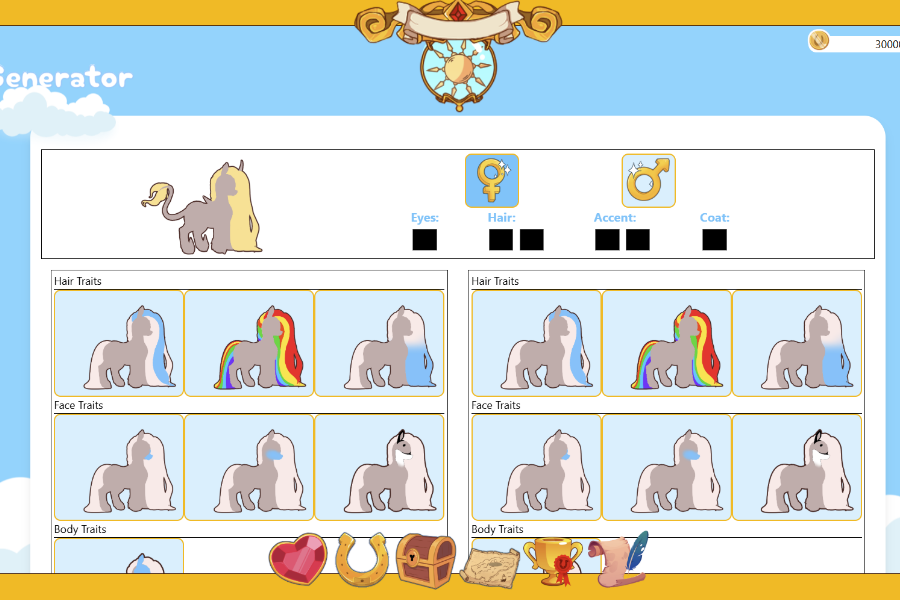
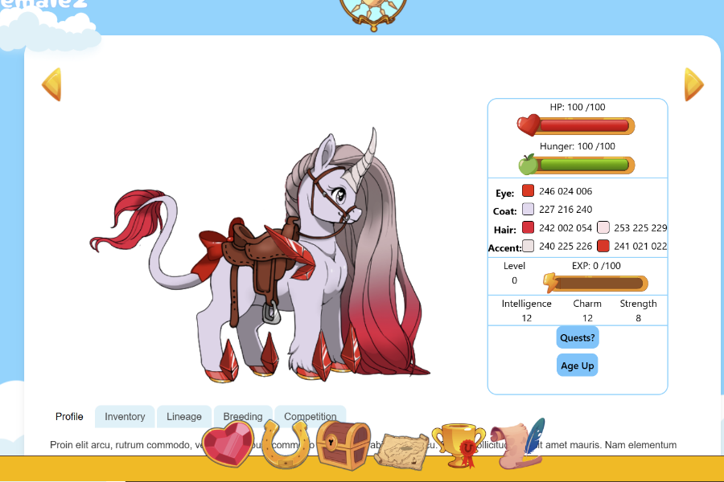

<h2 style="font-size: 3em; color: #fff; font-weight: 700;">An Upcoming Virtual Pet Site </h2>

My dream pony will be a browser based virtual pet site. You will be able to breed pony like pet creatures, train them, collect items, restock npc shops for currency, farming, cooking, creating custom items decorations for all your ponies. This game is currently in development and is not expected to be available to the public for some time. As I am the sole developer, artist, and marketing team 😊. As this is a passion project I am steadily working to develop it and improve the coding, art and features.

<h2 style="font-size: 3em; color: #fff; font-weight: 700;">Randomized Pet Generation </h2>

Players can select a desired color and generate a pet, with a chance of it matching their chosen hue. This generator will allow users to visually design ponies by selecting traits such as breed, gender, body color, mane style, eye color, and genetic markings. Which will add a level of challenge to the breeding game. 

<h2 style="font-size: 3em; color: #fff; font-weight: 700;">Randomized Pet Generation </h2>

Players can select a desired color and generate a pet, with a chance of it matching their chosen hue. This generator will allow users to visually design ponies by selecting traits such as breed, gender, body color, mane style, eye color, and genetic markings. Which will add a level of challenge to the breeding game. 

